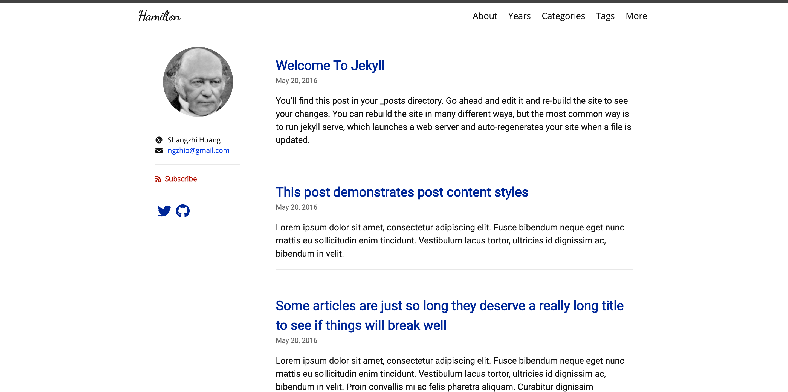
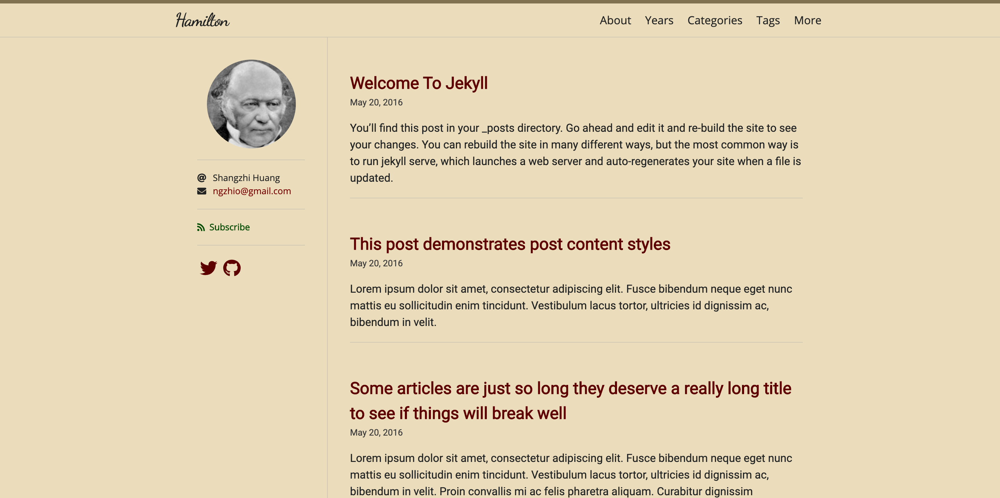
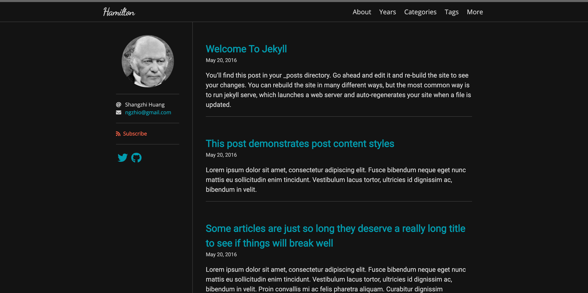

# Hamilton <!-- omit in toc -->

A minimal and beautiful Jekyll theme best for writing and note-taking.

The original purpose of this theme is to be a replacement of the default Jekyll theme -- [Minima](https://github.com/jekyll/minima). Hamilton is an enhancement of Minima but still, keep in minimal.

Please check out the [demo](https://ngzhio.github.io/jekyll-theme-hamilton/).

| Skins | Displays |
| ----- | -------- |
| Daylight |  |
| Sunrise/Sunset |  |
| Midnight |  |

## Features <!-- omit in toc -->

- [Jekyll SEO Tag](https://github.com/jekyll/jekyll-seo-tag)
- [Jekyll Feed](https://github.com/jekyll/jekyll-feed)
- [Jekyll Sitemap](https://github.com/jekyll/jekyll-sitemap)
- [Google Analytics](https://analytics.google.com/)
- [MathJax](https://www.mathjax.org/)
- [Disqus](https://disqus.com/)
- [Font Awesome](https://fontawesome.com/)
- TOC
- Customizable head
- Configurable page navigation
- Customizable styles and skins
- Archive pages implemented in pure Liquid

## Table of Contents <!-- omit in toc -->

- [Installation](#installation)
- [Configuration](#configuration)
  - [Optional Parameters](#optional-parameters)
- [Archive Pages](#archive-pages)
- [MathJax](#mathjax)
- [TOC](#toc)
- [Customization](#customization)
  - [Metadata](#metadata)
  - [Navigation](#navigation)
  - [Social Media](#social-media)
  - [Skins](#skins)
  - [More Customized Styles](#more-customized-styles)
- [License](#license)

## Installation

You can choose one of the following methods to install Hamilton:

- Directly specify the `jekyll-theme-hamilton` gem.

    1. Add `gem 'jekyll-theme-hamilton'` into your `Gemfile`.
    2. Add the below lines into your `_config.yml`.

        ```yml
        plugins:
          - jekyll-theme-hamilton
        ```

- If your site is hosted on GitHub Pages, you can use [`jekyll-remote-theme`](https://github.com/benbalter/jekyll-remote-theme) to import the master branch of Hamilton.

    1. Add `gem 'jekyll-remote-theme'` into your `Gemfile`.
    2. Add the below lines into your `_config.yml`.

        ```yml
        plugins:
          - jekyll-remote-theme

        remote_theme: ngzhio/jekyll-theme-hamilton
        ```

## Configuration

After installation, you can run `jekyll serve` to check out your site, but before that, *make sure* the below **required parameters** are configured in your `_config.yml`.

| Parameters | Types | Specifications |
|:---------- |:----- |:-------------- |
| `title`    | string | The site title |
| `disqus`   | string | The Disqus shortname; Unless you don't want to enable the comments system, you must specify this parameter. It is used in the production environment. |
| `google_analytics` | string | The Google Analytics tracking ID; It is used in the production environment. |

### Optional Parameters

| Parameters | Types | Specifications |
|:---------- |:----- |:-------------- |
| `author`   | string | The name of the author of the site; It would be showed in the copyright statement. |
| `avatar`   | string | The avatar of the author of the site. |
| `email`    | string | The email of the author of the site. |
| `location` | string | The current living location of the author of the site. |
| `skin`     | string | The skin name. See more information on the [Customization](#customization) section. |
| `lang`     | string | The language of the site; The default value is `en`. |
| `paginate` | int    | The number of posts on each page. |
| `date_format` | string | The date format; The default value is `%b %-d, %Y`. |
| `subscribe` | boolean | Show the subsribe feed button. |

## Archive Pages

Hamilton implements some archive templates in pure Liquid. For example, if you want to create a category archive page, set the below parameters on that page:

```yml
---
layout: archive-taxonomies
type: categories
---
```

Or a tag archive page:

```yml
layout: archive-taxonomies
type: tags
```

Or archive by years:

```yml
layout: archive-years
```

## MathJax

You can enable MathJax on each post or page, just set `math: true` on that page.

## TOC

If you want to show the Table of Contents of a post or page on the left sidebar, just set `toc: true` on that page.

## Customization

### Metadata

You can create a file `_includes/custom-head.html` in your repository, and add any metadata into that page, e.g. favicons.

### Navigation

You can create a file `_data/navigation.yml` to configure links to some pages. For example,

```yml
- title: About
  url: /about/
- title: Categories
  url: /categories/
- title: Tags
  url: /tags/
```

The navigation bar also supports dropdown submenus:

```yml
- title: About
  url: /about/
- title: Categories
  url: /categories/
- title: Tags
  url: /tags/
- title: More
  sublinks:
    - title: FAQ
      url: /faq/
    - title: Docs
      url: /docs/
```

### Social Media

You can create a file `_data/social.yml` to configure links to your social media. For example,

```yml
- title: Twitter
  url: https://twitter.com/ngzhio
  icon: fab fa-twitter
- title: GitHub
  url: https://github.com/ngzhio/jekyll-theme-hamilton
  icon: fab fa-github
```

### Skins

You can select a skin by setting `skin` in `_config.yml`. The built-in skins include `daylight`, `midnight`, `sunrise`, and `sunset`. If you don't specify any skin, Hamilton would dynamically select one in these built-in skins according to different hours in a day.

You can also customize a new skin, for example, a skin called `solarized`. You need to copy [`_sass/hamilton/skins/daylight.scss`](_sass/hamilton/skins/daylight.scss) into your repository and then rename it to `solarized.scss`, and adjust some colors in that file. Finally, specify `skin: solarized` in `_config.yml`.

### More Customized Styles

If you want to create more CSS styles in your site, creating a file `_sass/hamilton/custom-styles.scss`, and putting your code in there, Hamilton would automatically refer to them.

## License

The theme is available as open source under the terms of the [MIT License](LICENSE.txt).

```
Ubaid porfolio website
├─ .git
│  ├─ COMMIT_EDITMSG
│  ├─ config
│  ├─ description
│  ├─ FETCH_HEAD
│  ├─ HEAD
│  ├─ hooks
│  │  ├─ applypatch-msg.sample
│  │  ├─ commit-msg.sample
│  │  ├─ fsmonitor-watchman.sample
│  │  ├─ post-update.sample
│  │  ├─ pre-applypatch.sample
│  │  ├─ pre-commit.sample
│  │  ├─ pre-merge-commit.sample
│  │  ├─ pre-push.sample
│  │  ├─ pre-rebase.sample
│  │  ├─ pre-receive.sample
│  │  ├─ prepare-commit-msg.sample
│  │  ├─ push-to-checkout.sample
│  │  └─ update.sample
│  ├─ index
│  ├─ info
│  │  └─ exclude
│  ├─ logs
│  │  ├─ HEAD
│  │  └─ refs
│  │     ├─ heads
│  │     │  └─ main
│  │     └─ remotes
│  │        └─ origin
│  │           └─ main
│  ├─ objects
│  │  ├─ 00
│  │  │  └─ 8dd0758375dad5ceb2fb9ee9bbefa3076ff83d
│  │  ├─ 01
│  │  │  ├─ 30c2acc8bfa8e8340c895b35c1f9de81def2f7
│  │  │  └─ 6dddf77ed3b58b8b674e5cf264751101805537
│  │  ├─ 03
│  │  │  └─ 1aff236dbe315842df381612b458dd8d14b6f5
│  │  ├─ 05
│  │  │  ├─ 73c601097b57c14bc89741fa78e3aa4a1bca03
│  │  │  └─ b5e28a21215bb0dca2dc1bf8817bc11d5c45ac
│  │  ├─ 08
│  │  │  └─ 07d22cb72e300c47303d13fb3cf498c274a9d4
│  │  ├─ 0a
│  │  │  └─ ebd943696a3982752913c9687357e9836d6436
│  │  ├─ 0c
│  │  │  └─ a92aae5d6970ed75a240013efcfb9107e64587
│  │  ├─ 0e
│  │  │  └─ a52eeb6fdb6479123701c0b473c225d47b6bc2
│  │  ├─ 0f
│  │  │  └─ ddeb474cfcddb717e5db345d8a53497fe8e675
│  │  ├─ 11
│  │  │  ├─ 4d562c08fb131ce29decb4ee1f489bebefb91b
│  │  │  └─ 9585f558291de1edf035610b8c9a352be26753
│  │  ├─ 12
│  │  │  └─ bdcd1866497cf55c592aa748b74001cb617414
│  │  ├─ 14
│  │  │  └─ 5b21de42f160ec55e3084ea80cc8de5d753255
│  │  ├─ 15
│  │  │  └─ f2d2b7f1aa81ed7006fb08afb8ca25c115df70
│  │  ├─ 17
│  │  │  ├─ 05bdd7a07c4aff9a53cf89875a9c0396dd904e
│  │  │  └─ 712f126f81b0f1d214f1af16e069b0c9d34cb2
│  │  ├─ 19
│  │  │  ├─ 2eb9ce43389039996bc2e9344c5bb14b730d72
│  │  │  └─ 6c8d8bfa8b4c2cccd841c265c381b10132c9b2
│  │  ├─ 1a
│  │  │  └─ dd17c49264333f3d8f5540784af826c07c4992
│  │  ├─ 1b
│  │  │  ├─ 450933612c92c01c8d6f0e1db133f948699360
│  │  │  ├─ 755a82f39d54449597842a0c76b63e6507e95a
│  │  │  └─ 92b69b07debd3847d298fc765ed1ca2c0266f8
│  │  ├─ 1e
│  │  │  ├─ 0de360b0ab5e12b8c975ad863117f93c8ba20d
│  │  │  └─ 5b1ee6c2c109a4afc1d402cd4b4dcc8cc5c020
│  │  ├─ 23
│  │  │  ├─ a769ca36a0a06a4478ac57d29aed5db06030d5
│  │  │  └─ cddf806f14a71f4ecc9b3451aefb6c6ec55a82
│  │  ├─ 25
│  │  │  ├─ 95e0a2e1eb832f3bcab013ac62440d86f1e2c4
│  │  │  └─ 9d38580871b385b4c8da7527a80bb14f089a66
│  │  ├─ 29
│  │  │  ├─ 0b3e2a129cda15206605baf80b4c496e3af692
│  │  │  └─ eddfe65942d2eef3ceac929d316d2d85fbd13c
│  │  ├─ 30
│  │  │  └─ 4cb6b06d02a67102769d8f1bcb0011183b4c76
│  │  ├─ 32
│  │  │  └─ 2264f94a6db62595bc9e4980556015abd9dda3
│  │  ├─ 34
│  │  │  └─ f4d027aa481209dc0ec8435fca4e1db415a4ca
│  │  ├─ 39
│  │  │  ├─ 6d918cebb42323d61a267c6e059aa4d2094bf3
│  │  │  └─ aa4c989dca8bab7dcbf0b44547fb45954d1725
│  │  ├─ 3e
│  │  │  └─ 18fa6e26259506cba3ded014d2b5523411a440
│  │  ├─ 3f
│  │  │  └─ 7db1d048d60895f48df3c3f65de57843b08b7e
│  │  ├─ 41
│  │  │  └─ e2781c9277bd5fe44566802b1f06f84ed2da64
│  │  ├─ 42
│  │  │  └─ 4486d73066b846d3c2c214cb582fc4f482536c
│  │  ├─ 45
│  │  │  └─ 33a028ab0bb6a4abd556ef14db988d9765fff4
│  │  ├─ 46
│  │  │  └─ ffb62d582f921ff9d16447fd5e60c7c2706992
│  │  ├─ 47
│  │  │  └─ c5c25c42b63d3509468521a8a797efbd5f2df7
│  │  ├─ 48
│  │  │  └─ d2f1c9745ba9f8e32e5b4a8e82fe4412b5d122
│  │  ├─ 49
│  │  │  └─ dc63f8cfca7d7dbd3536f69e759abec96ba352
│  │  ├─ 4b
│  │  │  ├─ 825dc642cb6eb9a060e54bf8d69288fbee4904
│  │  │  └─ c0db13220007264316c09a1ebf9e91eda24caf
│  │  ├─ 4e
│  │  │  └─ 370cf2c5478d2b7732ea2900647c30ede45b89
│  │  ├─ 4f
│  │  │  ├─ 415c361eb752b3e78f96e7607a714eb501cab6
│  │  │  └─ 6f9bbe9dbd965bdb1983ff783cfb4b7d7c2339
│  │  ├─ 50
│  │  │  └─ f2c2360df374deff7300f6551d67a87e6c7d57
│  │  ├─ 51
│  │  │  └─ dc88760fb2dbb30f4ad54594b3a54ba5d91a5d
│  │  ├─ 55
│  │  │  ├─ 52949e18a38e8c5bc48f11a2a8ce52fada16ca
│  │  │  └─ f2af0040467dfdb91a161b37f5c19eaf6d9335
│  │  ├─ 56
│  │  │  └─ 52a9a267be62410436ab5029cca1ba5ed9fd40
│  │  ├─ 5a
│  │  │  ├─ 1c0a33cf8550078db6c5c4dfc52504fb7ff514
│  │  │  └─ aa32076ffb6de2862bc8365ee5f59f3b218b3f
│  │  ├─ 5b
│  │  │  └─ e6bcaf313dcc957a7bd7fc383c8fce231bab76
│  │  ├─ 5c
│  │  │  └─ 326fc04ce2de126d8aa38dfb07fa34fcd9882a
│  │  ├─ 5d
│  │  │  └─ 667607d81ac6226434dafdb62f6c89c446b2f5
│  │  ├─ 62
│  │  │  ├─ 6bf49b710165a59e338d7bddad267d27a4e937
│  │  │  └─ ac6d6b560ac373afdef166e80fd1f657acd2c4
│  │  ├─ 63
│  │  │  └─ f5fb83f894194b401483d72cfed8b0d26a5ceb
│  │  ├─ 64
│  │  │  └─ e2ddef1a7018a40660b9c6222fd354acddf3e8
│  │  ├─ 65
│  │  │  └─ f1fa4699285185bc9a550e3b741d63a7f68a44
│  │  ├─ 66
│  │  │  └─ 5439313fb8889645ede1772554dd1be959c9af
│  │  ├─ 6c
│  │  │  ├─ 2ba442a6779265a898473addd19d34e67eaa29
│  │  │  └─ 4e7d86c9fcd75d6d067acc271e0fca5b41ffb2
│  │  ├─ 72
│  │  │  └─ e274f19f8b457c51650658ee0ecd025ccbb94d
│  │  ├─ 73
│  │  │  └─ 6d7400ff4b99e0446c348f16300274a4862d02
│  │  ├─ 74
│  │  │  ├─ 7a9e280a687f92e17582021458add176671235
│  │  │  └─ df0eacb0a86191dd451e9a525cf94afa4e497b
│  │  ├─ 75
│  │  │  └─ dea213e51204980a3a4f5069943e7bbd94ad93
│  │  ├─ 77
│  │  │  └─ fd6e90814766de275bd373117f9b64e253bac0
│  │  ├─ 7c
│  │  │  └─ 4a21394300bb873d5ed6872b3bdbb74a098a90
│  │  ├─ 7d
│  │  │  └─ dec4efc617c7881a75ca99d86aef8fa529373c
│  │  ├─ 80
│  │  │  └─ 7ea8f9affef6a4f4285869c0ee3216a3f091a8
│  │  ├─ 81
│  │  │  ├─ 181e58d34f321d4d0248ac9039c39ea0c5170f
│  │  │  └─ b98351b58bb0f87025d456cdd559220f7cea68
│  │  ├─ 85
│  │  │  ├─ 59a67ffad200c6a614dabe993541758bde89cc
│  │  │  ├─ 8660083d660856eb7ec17c40bf98597a0b65f7
│  │  │  ├─ cbbef79ee69347a85dc87570bb3dfedfffadfd
│  │  │  └─ d130fb207201bc492fbebb4cc18e097b60348a
│  │  ├─ 8a
│  │  │  ├─ 796095604feef5dfa87d893f6da6fc23f98456
│  │  │  └─ a85e57770f6e693c0bea61149d8d9384cccb67
│  │  ├─ 8c
│  │  │  └─ 485641177b3867ae3895959413f1b605f91ee6
│  │  ├─ 8f
│  │  │  └─ e98b8bde0d27129fab43a2c471b1d5d09d84a0
│  │  ├─ 91
│  │  │  ├─ 00d3097cbae6b6a2fbf9a82b921482a49cefd1
│  │  │  ├─ 034218324e41b969269986a12c51d8c7745934
│  │  │  └─ 9ec07c5f8bbf67fafddafeea9f9f7efccb364a
│  │  ├─ 92
│  │  │  └─ 1b19f1b946d0740fa7cd82c5e9e178c7a79347
│  │  ├─ 95
│  │  │  └─ 8d5d73397d89ed93d3525f5030f8d88e62abd2
│  │  ├─ 99
│  │  │  └─ 1870e266a13141c4de869362c09a98a318e87c
│  │  ├─ 9a
│  │  │  └─ ff5c309de69c0fd06451a1a71088d01f8b6d78
│  │  ├─ 9b
│  │  │  └─ d0f2c69386b8611365356e92d327336eef3489
│  │  ├─ 9c
│  │  │  └─ 45feef086e68fd31bfea774ad40fb8ad1fb79c
│  │  ├─ 9e
│  │  │  ├─ 5d599b54404f535bd71de9d911b010343cc492
│  │  │  └─ 9f863501f83b7f06bd06ebd6133ef57bbd2e46
│  │  ├─ 9f
│  │  │  └─ 72e32b23f8c6fc42f96b9b5405b34fb0deb0b7
│  │  ├─ a0
│  │  │  └─ c566cf42a2ca9ba15c682c5b7e6f454ae38cf9
│  │  ├─ a1
│  │  │  └─ 7b16d2b46c73197ce6604704cf0d1f33cacca7
│  │  ├─ a2
│  │  │  └─ ee12db5c43f56ea6391968fd3045d13434489b
│  │  ├─ a3
│  │  │  └─ de72679f122766c370a4d7c0f1c1ce5090edde
│  │  ├─ a4
│  │  │  └─ c10f921de7882ec014bb0c72a8ac09598d3e2b
│  │  ├─ a5
│  │  │  └─ f6ef72e88dc517307f88a9d389cd529f4b5f0a
│  │  ├─ a6
│  │  │  └─ 1ba61cc45f42e8bc66681ee6faadb14f98e1dd
│  │  ├─ a8
│  │  │  └─ 60e7c4145cef6ad103906c29c27039f2fd3e2f
│  │  ├─ a9
│  │  │  └─ 286a3b68013d132e0a2d830a2923afdc7f6ec5
│  │  ├─ aa
│  │  │  └─ 5b7ec5bdb7838b724cbad1a17bd8800549565d
│  │  ├─ ad
│  │  │  └─ b4ec1d40a33b5bb0839992ac50ca417febfd0b
│  │  ├─ ae
│  │  │  └─ ba1a15aaaa20e534325b9ea01f7c65e27f1e0f
│  │  ├─ af
│  │  │  └─ 8f5052e5192103401fdd96d6ad3d066ee66870
│  │  ├─ b0
│  │  │  └─ 593d6082be56ca8edef2eef3664481bca6343a
│  │  ├─ b2
│  │  │  └─ 0db6f9e9c5e7f2ff1df1092cb6f81f4c9bc6b6
│  │  ├─ b7
│  │  │  └─ efe3a6e1dfc5ac02b0a23195ae8588a1e17ae1
│  │  ├─ ba
│  │  │  └─ 837a2446f0271db3ef92b099dbd66751256a4f
│  │  ├─ bb
│  │  │  ├─ 22df52b1a84f1a54b3e3972870d6b095e18434
│  │  │  ├─ 7d1153d0ba86e5f54c0a5372bfc4b57cd495c1
│  │  │  └─ 94df82938cff0e4f4b9b1f2d2974854215bb00
│  │  ├─ bc
│  │  │  ├─ 8105624b6ee99abac990ff67eb5da19a6570d1
│  │  │  └─ b9c489e61aecc773139c9d681ca8359c201c30
│  │  ├─ bd
│  │  │  └─ 6ae9855003ebeb7af79004fa40f6ff7cbc5baa
│  │  ├─ bf
│  │  │  ├─ abd8e89478f7888372469e2b51e90794b398d3
│  │  │  └─ edc13464fb952e6332f12689ed1686eed00138
│  │  ├─ c0
│  │  │  └─ 93910282809a98b8608968a20a40e61bd55a30
│  │  ├─ c1
│  │  │  ├─ 1f080f6a4937b17ddbfc58c68f3efe5d0d91c4
│  │  │  └─ 51d2c144d75c00971f2e7207a6c10ba0451418
│  │  ├─ c2
│  │  │  ├─ 07f986277523ca35c7f0237940e27d11bde87c
│  │  │  └─ f520f2ad54e3507425cb44fd7350e1789a3844
│  │  ├─ c4
│  │  │  └─ 72b4ea0a781061dab1f394627222735d4215bd
│  │  ├─ c7
│  │  │  ├─ ab1a53157c68d8355f2e48fe2da5e1c0453eba
│  │  │  └─ fcd7ec9463552f176a21fae354f23859e363e3
│  │  ├─ c8
│  │  │  └─ 8eedee1bcc82f72d7fead79357f6ea84882c17
│  │  ├─ c9
│  │  │  └─ 25c641f39a66dfdf6f4d5469788ea66735860e
│  │  ├─ ca
│  │  │  └─ 4a189308f157b2f64e1057f3529477cd7377dd
│  │  ├─ cc
│  │  │  └─ 4b4b4340083a6c93f1435866be57cd86cee8df
│  │  ├─ cf
│  │  │  ├─ 0cd92ceb73b9c88568e77c1da5de9ce71c80bf
│  │  │  └─ f7bc8e3a6c9e3aa5a17c6f19fd195e1bd4a3cb
│  │  ├─ d1
│  │  │  └─ cebbb65d7f88bb48af3305449f06bef4f4e3e4
│  │  ├─ d2
│  │  │  └─ 6fc7ce87e90f34b12c94c9c6f1f7ac2189e178
│  │  ├─ d6
│  │  │  ├─ 14f4a74dfbf7f68fa58070088ad2161d0c4494
│  │  │  └─ 956895a5601f264e144ce06eb0e76072a6f4eb
│  │  ├─ d8
│  │  │  ├─ 6994350f9353fb43782499e28dc0f01ae055cc
│  │  │  └─ d39619010d9c42ae63386ce0fba2db82cccc18
│  │  ├─ da
│  │  │  └─ 83b2298f7c6040957a3eab651b5fc785a8dd4a
│  │  ├─ db
│  │  │  └─ d3295d4bc581371acf7c779cdb3077592faad7
│  │  ├─ df
│  │  │  ├─ 91f283e40075b68197b0351c7360f5ffa1113c
│  │  │  └─ ea309a0e716a5ab818d2d34409c36b75a8cd9d
│  │  ├─ e1
│  │  │  └─ 2bec66845a91570ef3aa07aecf19e4480a707b
│  │  ├─ e3
│  │  │  └─ b5e86052868f3683efa4bd05eea27b9862554b
│  │  ├─ e4
│  │  │  └─ d427d215f4d4a8c497ea69a84daf98f198e4ba
│  │  ├─ e6
│  │  │  ├─ c1cb4ae603d5c420de2ce775f700824b608bee
│  │  │  └─ f87ad5c4040a3eb8c212bcaa0b9d963a25a813
│  │  ├─ e7
│  │  │  └─ 65ff13d581e0fa1c30644b579576e309912d9e
│  │  ├─ e8
│  │  │  └─ f40ae8e5d2ef61df4b47a059d351e95b73e131
│  │  ├─ ec
│  │  │  └─ 6fccb25836f04dc233dd27ff42919c9ccb6545
│  │  ├─ ed
│  │  │  └─ d3ceec56711f618c09dc62ff3ac8bb0f6abeab
│  │  ├─ ee
│  │  │  ├─ 8ed81491c3a4d9c677cecd2a5a82fdc72f8992
│  │  │  └─ f80395a051a2e540596938ed54bf95fbdfa017
│  │  ├─ ef
│  │  │  └─ 146db19ace41fe8e546b4b1eaf63a201eab252
│  │  ├─ f0
│  │  │  └─ edb614f10b081682aeb4643affa47e1cf49021
│  │  ├─ f4
│  │  │  └─ add44ee2807373512421697dcd3503074baa1c
│  │  ├─ f6
│  │  │  └─ bf4b6e1f2fa88e3f60ce0194679e4385199485
│  │  ├─ f7
│  │  │  └─ e2c0cf6d9d6af406f342af71f681ff21da2382
│  │  ├─ fb
│  │  │  └─ 9b60d8195f7d2dafd631652846c1f69e250e73
│  │  ├─ fe
│  │  │  └─ bea420be2ac9020c23132f77daf819be0416da
│  │  ├─ ff
│  │  │  └─ a20e22633660a55df457b65de5f67f99ae8f8c
│  │  ├─ info
│  │  └─ pack
│  ├─ ORIG_HEAD
│  └─ refs
│     ├─ heads
│     │  └─ main
│     ├─ remotes
│     │  └─ origin
│     │     └─ main
│     └─ tags
├─ .gitignore
├─ 404.html
├─ about.md
├─ assets
│  └─ css
│     ├─ custom.css
│     ├─ main.scss
│     ├─ skin-daylight.scss
│     ├─ skin-midnight.scss
│     ├─ skin-sunrise.scss
│     ├─ skin-sunset.scss
│     └─ skin.scss
├─ categories.md
├─ docs.md
├─ faq.md
├─ favicon.ico
├─ Gemfile
├─ index.html
├─ LICENSE.txt
├─ logo.png
├─ README.md
├─ screenshot-midnight.png
├─ screenshot-sunrise.png
├─ screenshot.png
├─ scripts
│  └─ server
├─ tags.md
├─ years.md
├─ _config.yml
├─ _data
│  ├─ navigation.yml
│  └─ social.yml
├─ _includes
│  ├─ custom-head.html
│  ├─ disqus.html
│  ├─ footer.html
│  ├─ google-analytics.html
│  ├─ head.html
│  ├─ header.html
│  ├─ mathjax.html
│  ├─ sidebar-toc.html
│  ├─ sidebar.html
│  └─ toc.html
├─ _layouts
│  ├─ archive-taxonomies.html
│  ├─ archive-years.html
│  ├─ default.html
│  ├─ home.html
│  ├─ page.html
│  └─ post.html
├─ _posts
│  └─ 2016-05-20-welcome-to-jekyll.md
└─ _sass
   └─ hamilton
      ├─ base.scss
      ├─ custom-styles.scss
      ├─ functions.scss
      ├─ layout.scss
      ├─ main.scss
      ├─ normalize.scss
      ├─ override-variables.scss
      ├─ skin.scss
      ├─ skins
      │  ├─ daylight.scss
      │  ├─ midnight.scss
      │  ├─ sunrise.scss
      │  └─ sunset.scss
      └─ variables.scss

```